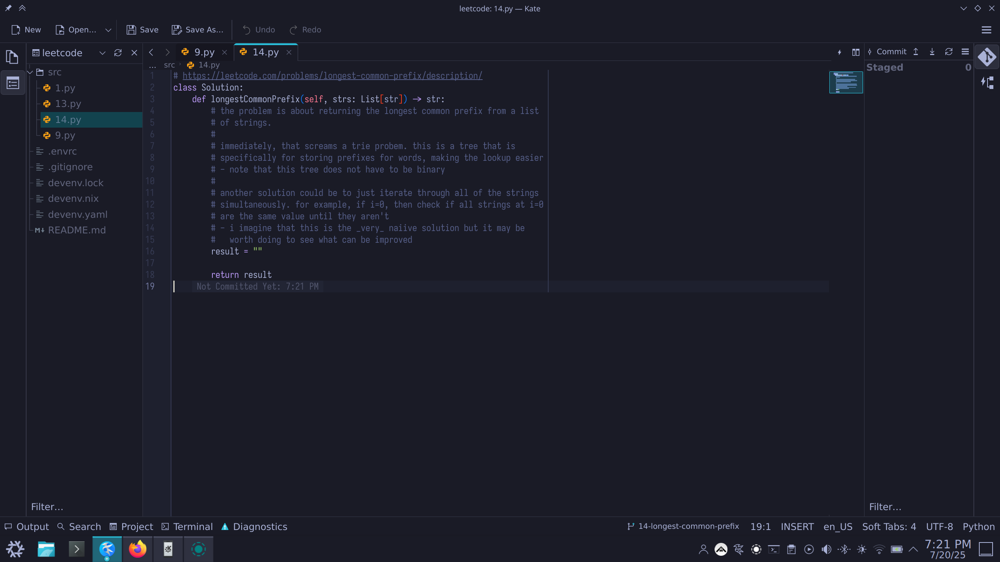
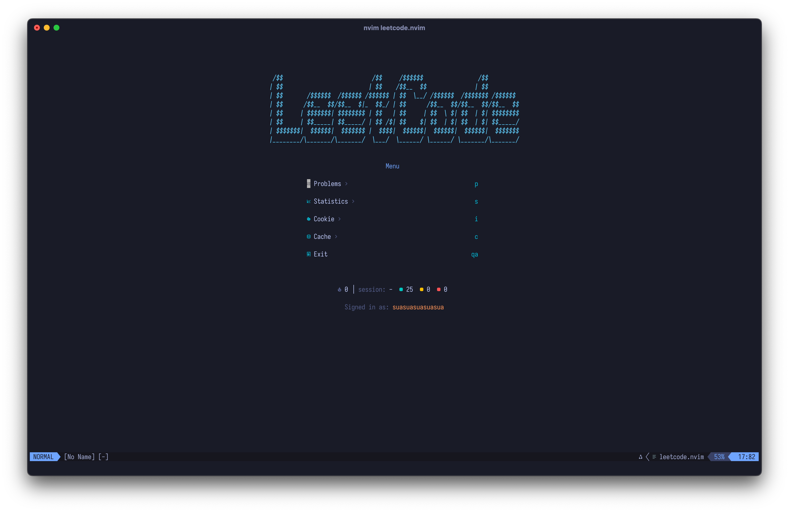
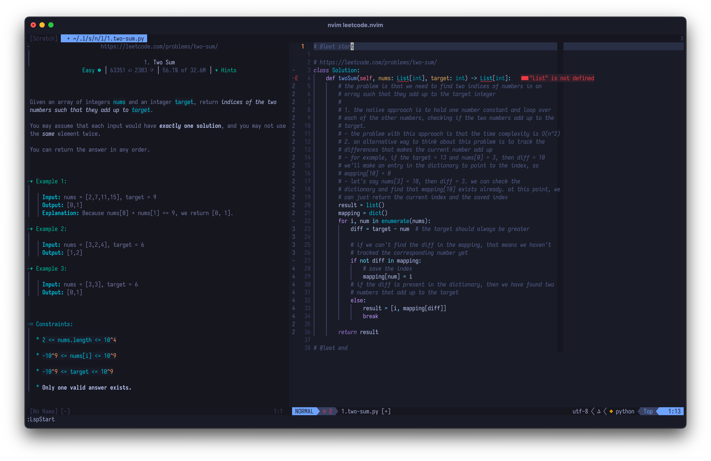

# Leet Code

> Author: Justin Hoang

My repository containing my Leet Code solutions.

## Workflow

- No external libraries
  - Builtins from `python` like `collections` is fine
- Each problem will be solved under its own pull request.
  
- Simple text editors or IDEs like
[`neovim`](https://github.com/kawre/leetcode.nvim), Zed, and Kate with an LSP
  
  
  
- Update progress on gitea
  - Remember to add and resolve pull requests
  - Add problems to the milestone and project
  - Write quirks and new knowledge to the wiki
